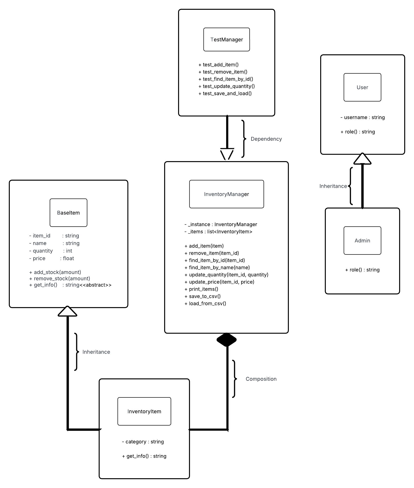

# Inventory Management System Report

Darba atliko: Danguolė Parachnevičiūtė EDIf-25/2
---
Darba tikrino: Tomasz Szturo
---
Šio darbo tema – inventoriaus valdymo sistemos kūrimas naudojant Python ir objektinio programavimo (OOP) principus.

### Įvadas 

#### Kokia tai aplikacija?
Ši aplikacija yra Inventory Management System, sukurta naudojant Python, kuri leidžia vartotojui valdyti inventorių: pridėti, pašalinti, ieškoti ir keisti prekes (items). Šio projekto tikslas – sukurti sistemą, pritaikant OOP principus ir užtikrinant efektyvų bei patogų vartotojo inventoriaus valdymą. Kiekvienas vartotojas turi savo inventorių, kuris saugomas atskirame CSV faile.

Programa sukurta naudojant **Object-Oriented Programming (OOP)** principus:  
**Encapsulation, Inheritance, Polymorphism ir Abstraction**.

#### Kaip paleisti aplikaciją?
1. Įsidiek Python  
2. Atsisiųsk projektą iš GitHub  
3. Atidaryk terminalą projekto aplanke  
4. Paleisk: python main.py

#### Kaip naudoti programą?
1. Įvesk savo username  
2. Pasirink vieną veiksmą iš meniu:
    - 1 Add item
    - 2 Remove item
    - 3 Show inventory
    - 4 Save inventory
    - 5 Load inventory
    - 6 Find item by ID
    - 7 Find item by name
    - 8 Update quantity
    - 9 Update price
    - 10 Show statistics
    - 0 Exit
3. Išeinant programa automatiškai išsaugo duomenis  

---

### Functional Requirements
1. Pridėti prekę (**Add item**)  
2. Pašalinti prekę (**Remove item**)  
3. Peržiūrėti inventorių (**Show inventory**)  
4. Išsaugoti inventorių (**Save inventory**)  
5. Užkrauti inventorių (**Load inventory**)  
6. Ieškoti prekės pagal ID (**Find item by ID**)  
7. Ieškoti prekės pagal pavadinimą (**Find item by name**)  
8. Keisti prekės kiekį (**Update quantity**)  
9. Keisti prekės kainą (**Update price**)  
10. Peržiūrėti statistiką (**Show statistics**)  
Šios funkcijos yra įgyvendintos programos kode naudojant atitinkamus metodus. 
Toliau pateikiami kodo fragmentai parodo, kaip šie reikalavimai realizuoti praktikoje.

### Pavyzdžiai

### 1. 
```python
def add_item(self, item):
    if self.find_item_by_id(item._item_id) is None:
        self._items.append(item)
        return True
    return False
```
Funkcija **add_item** leidžia vartotojui pridėti naują prekę į inventorių.
Ji tikrina, ar prekės ID jau neegzistuoja, taip išvengia dubliavimo.

### 2. 
```python
def remove_item(self, item_id):
    for item in self._items:
        if item._item_id == item_id:
            self._items.remove(item)
            return True
    return False
```
Funkcija **remove_item** leidžia pašalinti prekę pagal jos ID. 
Jei prekė randama, ji pašalinama iš inventoriaus sąrašo.

### 3.
```python
def print_items(self):
    if not self._items:
        print("Inventory empty.")
        return

    print(f"{'ID':<10}{'Name':<15}{'Quantity':<10}{'Price':<12}{'Category'}")
    print("-" * 55)
    
    for item in sorted(self._items, key=lambda x: x._item_id):
        price_text = f"{item._price:.2f}€"
        print(f"{item._item_id:<10}{item._name:<15}{item._quantity:<10}{price_text:<12}{item._category}")
```
Funkcija **print_items** leidžia vartotojui matyti visą inventorių. 
Prekės pateikiamos lentelės forma su ID, pavadinimu, kiekiu, kaina ir kategorija.

### 4.
```python
def save_to_csv(self, filename):
    try:
        os.makedirs(os.path.dirname(filename), exist_ok=True)

        with open(filename, "w", newline="") as f:
            writer = csv.writer(f)
            writer.writerow(["id", "name", "quantity", "price", "category"])

            for item in self._items:
                writer.writerow([
                    item._item_id,
                    item._name,
                    item._quantity,
                    item._price,
                    item._category
                ])
    except Exception as e:
        print("Error saving file:", e)
```
Funkcija **save_to_csv** išsaugo inventoriaus duomenis į CSV failą. 
Kiekviena prekė įrašoma kaip atskira eilutė.

### 5.
```python
def load_from_csv(self, filename):
    try:
        self._items.clear()

        if not os.path.exists(filename):
            print("No existing inventory found")
            return

        with open(filename, "r") as f:
            reader = csv.DictReader(f)

            for row in reader:
                item = InventoryItem(
                    row["id"],
                    row["name"],
                    int(row["quantity"]),
                    float(row["price"]),
                    row["category"]
                )
                self._items.append(item)

    except FileNotFoundError:
        print("File not found.")
    except Exception as e:
        print("Error loading file:", e)
```
Funkcija **load_from_csv** užkrauna anksčiau išsaugotus inventoriaus duomenis iš CSV failo. 
Tai leidžia vartotojui tęsti darbą su savo inventoriaus duomenimis.

### 6.
```python
def find_item_by_id(self, item_id):
    for item in self._items:
        if item._item_id == item_id:
            return item
    return None
```
Funkcija **find_item_by_id** leidžia rasti konkrečią prekę pagal jos ID. 
Jei prekė nerandama, grąžinama None.

### 7.
```python
def find_item_by_name(self, name):
    for item in self._items:
        if item._name.lower() == name.lower():
            return item
    return None
```
Funkcija **find_item_by_name** leidžia rasti prekę pagal pavadinimą. 
Paieška nėra jautri didžiosioms ir mažosioms raidėms.

### 8.
```python
def update_quantity(self, item_id, new_quantity):
    item = self.find_item_by_id(item_id)
    if item is not None:
        item._quantity = new_quantity
        return True
    return False
```
Funkcija **update_quantity** leidžia pakeisti pasirinktos prekės kiekį. 
Pirmiausia prekė surandama pagal ID, tada jos kiekis atnaujinamas.

### 9.
```python
def update_price(self, item_id, new_price):
    item = self.find_item_by_id(item_id)
    if item is not None:
        item._price = new_price
        return True
    return False
```
Funkcija **update_price** leidžia pakeisti pasirinktos prekės kaina. 
Pirmiausia prekė surandama pagal ID, tada jos kaina yra atnaujinama.

### 10.
```python
def get_total_items(self):
    return len(self._items)

def get_total_quantity(self):
    total = 0
    for item in self._items:
        total += item._quantity
    return total

def get_total_value(self):
    total = 0
    for item in self._items:
        total += item._quantity * item._price
    return total
```
Šios funkcijos leidžia peržiūrėti inventoriaus statistiką:
- **get_total_items** grąžina skirtingų prekių skaičių
- **get_total_quantity** apskaičiuoja bendrą prekių kiekį
- **get_total_value** apskaičiuoja bendrą inventoriaus vertę

---

### OOP principai
#### Encapsulation
Duomenys saugomi apsaugotuose atributuose, pažymėtuose apatiniu brūkšniu, pvz. **_item_id, _name**. 
Taip parodoma, kad šie duomenys neturėtų būti tiesiogiai keičiami iš išorės.
```python
self._item_id
self._name
```
Prieiga vyksta per properties:
```python
@property
def name(self):
    return self._name
```
Tai padeda apsaugoti duomenis.

#### Inheritance
```python
class InventoryItem(BaseItem):
```
**InventoryItem** paveldi iš **BaseItem**, todėl nereikia kartoti kodo.

#### Polymorphism
```python
def get_info(self):
```
Tas pats metodas gali veikti skirtingai skirtingose klasėse.

#### Abstraction
```python
class BaseItem(ABC):
    @abstractmethod
    def get_info(self):
        pass
```
**Abstract** class nurodo, kokie metodai turi būti.

#### Design Pattern – Singleton
```python
_instance = None
```
**Singleton** pasirinktas, nes inventorius turi būti valdomas centralizuotai – naudojant kelis objektus galėtų atsirasti duomenų neatitikimai, todėl šis pattern yra tinkamas. Jis užtikrina, kad egzistuoja tik vienas **InventoryManager** objektas, leidžiantis centralizuotai valdyti visą inventorių ir išvengti duomenų nesuderinamumo.

#### Composition
```python
self._items = []
```
InventoryManager turi prekių sąrašą **self._items**, kuriame saugomi **InventoryItem** objektai. 
Tai parodo composition ryšį, nes **InventoryManager** objektas valdo kitus objektus.

#### File Handling
```python
def save_to_csv(self, filename):
```
```python
def load_from_csv(self, filename):
```
Duomenys saugomi faile:
```python
data/{username}_inventory.csv
```
---

### UML diagrama 
Ši UML diagrama vaizduoja sistemos klasių struktūrą ir jų tarpusavio ryšius.


#### UML paaiškinimas
- InventoryItem paveldi BaseItem - Inheritance
- Admin paveldi User
- InventoryManager turi InventoryItem -  Composition
- TestManager naudojamas testavimui

---

### Testing (Unit Testing)
Programoje naudojamas Python **unittest** framework. Testai yra skirti patikrinti pagrindinį **InventoryManager** funkcionalumą: prekių pridėjimą, pašalinimą, paiešką, duomenų atnaujinimą bei išsaugojimą ir užkrovimą iš CSV failo.
```python
import unittest
import os
from models.item import InventoryItem
from models.manager import InventoryManager

class TestManager(unittest.TestCase):

    def setUp(self):
        InventoryManager._instance = None
        self.manager = InventoryManager()
        self.manager._items.clear()
        self.test_file = "data/test_inventory.csv"

        if os.path.exists(self.test_file):
            os.remove(self.test_file)

    def tearDown(self):
        if os.path.exists(self.test_file):
            os.remove(self.test_file)

    def test_add_item(self):
        item = InventoryItem("1", "Mouse", 10, 15, "Electronics")
        result = self.manager.add_item(item)

        self.assertTrue(result)
        self.assertEqual(len(self.manager._items), 1)

    def test_no_duplicate_id(self):
        item1 = InventoryItem("1", "Mouse", 10, 15, "Electronics")
        item2 = InventoryItem("1", "Keyboard", 5, 20, "Electronics")

        self.manager.add_item(item1)
        result = self.manager.add_item(item2)

        self.assertFalse(result)
        self.assertEqual(len(self.manager._items), 1)

    def test_remove_item(self):
        item = InventoryItem("1", "Mouse", 10, 15, "Electronics")
        self.manager.add_item(item)

        result = self.manager.remove_item("1")

        self.assertTrue(result)
        self.assertEqual(len(self.manager._items), 0)

    def test_save_and_load(self):
        item = InventoryItem("1", "Mouse", 10, 15, "Electronics")
        self.manager.add_item(item)

        self.manager.save_to_csv(self.test_file)

        InventoryManager._instance = None
        new_manager = InventoryManager()
        new_manager.load_from_csv(self.test_file)

        self.assertEqual(len(new_manager._items), 1)
        self.assertIsNotNone(new_manager.find_item_by_id("1"))

    def test_find_item_by_id(self):
        item = InventoryItem("1", "Mouse", 10, 15, "Electronics")
        self.manager.add_item(item)

        found_item = self.manager.find_item_by_id("1")

        self.assertIsNotNone(found_item)
        self.assertEqual(found_item._name, "Mouse")

    def test_find_item_by_name(self):
        item = InventoryItem("1", "Mouse", 10, 15, "Electronics")
        self.manager.add_item(item)

        found_item = self.manager.find_item_by_name("Mouse")

        self.assertIsNotNone(found_item)
        self.assertEqual(found_item._item_id, "1")

    def test_update_quantity(self):
        item = InventoryItem("1", "Mouse", 10, 15, "Electronics")
        self.manager.add_item(item)

        result = self.manager.update_quantity("1", 25)

        self.assertTrue(result)
        self.assertEqual(self.manager.find_item_by_id("1")._quantity, 25)
```
Testuose naudojami metodai **setUp()** ir **tearDown()**. **setUp()** paruošia švarią testavimo aplinką prieš kiekvieną testą, o **tearDown()** pašalina testavimo metu sukurtą CSV failą. Tai svarbu, nes kiekvienas testas turi buti individualus. 

#### Testai tikrina:
- **test_add_item** – ar prekė sėkmingai pridedama į inventorių;
- **test_no_duplicate_id** – ar sistema neleidžia pridėti dviejų prekių su tuo pačiu ID;
- **test_remove_item** – ar prekė sėkmingai pašalinama;
- **test_save_and_load** – ar duomenys teisingai išsaugomi ir užkraunami iš CSV failo;
- **test_find_item_by_id** – ar veikia paieška pagal ID;
- **test_find_item_by_name** – ar veikia paieška pagal pavadinimą;
- **test_update_quantity** – ar galima pakeisti prekės kiekį.
Šie unit testai padeda užtikrinti, kad pagrindinis programos funkcionalumas veikia teisingai ir stabiliai.

---

### Rezultatai
- Programa sėkmingai veikia ir leidžia valdyti inventorių (pridėti, pašalinti, ieškoti bei atnaujinti duomenis)
- Duomenys yra saugomi ir užkraunami naudojant CSV failus, užtikrinant duomenų išlikimą
- Testai patvirtina pagrindinių sistemos funkcijų veikimą, o **Singleton pattern** užtikrina vieną **InventoryManager** objektą
- Didžiausi iššūkiai buvo susiję su teisingu duomenų išsaugojimu CSV faile ir sistemos architektūros organizavimu
- Taip pat reikėjo papildomo laiko išmokti naudotis **GitHub** ir valdyti projekto versijas

---

### Išvados
Šis darbas parodė, kaip galima sukurti paprastą Inventory Management System, o jo metu buvo sukurta veikianti sistema, pritaikant visus pagrindinius OOP principus. Programa leidžia paprastai valdyti inventorių – pridėti, pašalinti, ieškoti ir atnaujinti prekes, o duomenys saugomi CSV failuose. Ateityje sistema gali būti plečiama pridedant grafinę vartotojo sąsają (GUI) arba naudojant duomenų bazę vietoje CSV failų. Taip pat būtų galima pagerinti klaidų tikrinimą, pridėti daugiau funkcijų, sukurti pažangesnę paiešką ir filtravimą bei įdiegti vartotojo autentifikaciją.

---

### Šaltiniai
- About GitHub  https://docs.github.com/en/get-started/start-your-journey/about-github-and-git
- Git command cheat sheet (1) https://education.github.com/git-cheat-sheet-education.pdf
- Git command cheat sheet (2) https://about.gitlab.com/images/press/git-cheat-sheet.pdf
- Markdown syntax (1) https://www.markdownguide.org/basic-syntax/
- Markdown syntax (2) https://github.github.com/gfm/
- Unit test framework https://docs.python.org/3/library/unittest.html